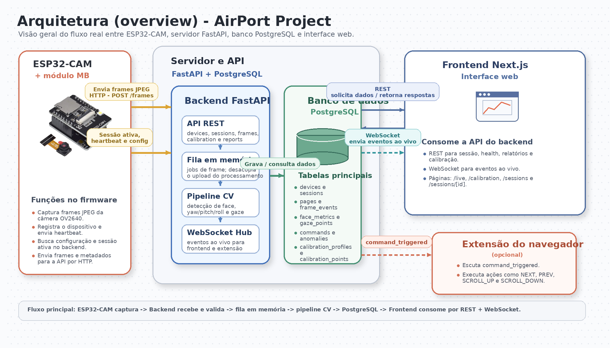

# GazePilot Architecture

## Visão geral

GazePilot é um sistema híbrido para navegação hands-free:

1. **ESP32-CAM** captura JPEG e envia para o backend.
2. **FastAPI** processa head pose/gaze, persiste eventos no PostgreSQL e publica eventos em WebSocket.
3. **Next.js Dashboard** consome REST + WS para live monitoring, calibração e relatórios com heatmap.

## Overview da arquitetura

O diagrama principal da arquitetura do projeto passa a ser a imagem final abaixo:

Arquivo fonte: `docs/assets/architecture/arquitetura_overview.png`

Ela resume a separação entre:

- captura no edge com ESP32-CAM;
- ingestao e processamento no backend FastAPI;
- persistencia em PostgreSQL;
- distribuicao de eventos por WebSocket;
- consumo no dashboard web.

## Componentes

### 1) Firmware (`esp32-cam`)

- Captura frames OV2640 (JPEG).
- Envia multipart para `POST /api/v1/frames` com `file`, `device_key`, `session_id`, `ts`.
- Busca configuração dinâmica em `GET /api/v1/device-config/{device_id}` (alias REST: `GET /api/v1/devices/config/{device_id}`).
- Mantém heartbeat (`POST /api/v1/devices/heartbeat`).
- Faz pareamento de sessão via `GET /api/v1/sessions/active?device_id=...` para evitar divergência entre firmware e dashboard.

### 2) Backend (`backend-fastapi`)

- API REST + `WS /api/v1/ws/live`.
- Banco principal: **PostgreSQL**.
- CV pipeline MVP (OpenCV): detecção de face + proxy de yaw/pitch/roll.
- CV pipeline robusto: MediaPipe Face Landmarker + `solvePnP` para head pose, com fallback OpenCV.
- Engine de comandos: EMA + histerese + cooldown.
- Mapeamento de gaze: regressão linear treinada por pontos de calibração.
- Queue mode:
  - `sync` (síncrono)
  - `memory` (fila em memória)
  - `redis` (produção com worker opcional)

### 3) Frontend (`frontend-nextjs`)

- `/live`: métricas e eventos em tempo real.
- `/calibration`: wizard 5/9 pontos.
- `/sessions`: histórico.
- `/sessions/[id]`: relatório com heatmap, timeline e comandos.

## Fluxos principais

### Fluxo MVP (Head Pose -> Commands)

1. Frame chega em `/frames`.
2. Pipeline estima yaw/pitch/roll.
3. Engine aplica regras:
   - `yaw > +20°` por 400ms -> `NEXT`
   - `yaw < -20°` por 400ms -> `PREV`
   - `pitch < -15°` por 400ms -> `SCROLL_DOWN`
   - `pitch > +15°` por 400ms -> `SCROLL_UP`
4. Evento de comando é persistido e publicado no WS.

Observação de consistência:

- ao criar nova sessão com `POST /sessions/start`, o backend encerra sessão ativa anterior do mesmo `device_id`.
- isso evita duas sessões abertas em paralelo para o mesmo hardware.

### Fluxo de calibração -> heatmap

1. Frontend cria `calibration_profile`.
2. Usuário coleta 5/9 pontos com features faciais.
3. Backend treina regressão linear e salva `params_json`.
4. Frames seguintes geram `gaze_points` com source `calibrated_regression`.
5. Endpoint de relatório agrega bins para heatmap.

## Persistência

Tabelas principais:

- devices
- sessions
- pages
- calibration_profiles
- calibration_points
- frame_events
- face_metrics
- gaze_points
- commands
- anomalies

## Por que o domínio é fortemente relacional

O centro do sistema é um grafo de entidades com dependência forte:

- `devices -> sessions -> frame_events` (todo frame pertence a um device e a uma sessão)
- `frame_events -> face_metrics` (1:1)
- `frame_events -> gaze_points` (1:N)
- `sessions -> commands / anomalies / pages` (1:N)
- `pages -> gaze_points` (contexto de página ativo, opcional por ponto)
- `calibration_profiles -> calibration_points` por `device_id`

Esse padrão exige:

- integridade referencial (FK/UNQ)
- joins frequentes para relatório (`summary`, `heatmap`, `timeline`, `commands`)
- consistência transacional (ex.: uma sessão ativa por dispositivo)

Por isso PostgreSQL atende bem o núcleo operacional atual.

## Escalabilidade temporal (13k+ frames em minutos)

`13k` frames em poucos minutos já é um volume de série temporal relevante, mas ainda totalmente tratável em PostgreSQL com índice e retenção corretos.

Evolução recomendada:

1. curto prazo: manter PostgreSQL atual com índices em `session_id`, `device_id`, `ts` e políticas de retenção.
2. médio prazo: particionamento por tempo (`frame_events`, `gaze_points`, `commands`).
3. médio/longo prazo: habilitar TimescaleDB (PostgreSQL + hypertables) para compressão e agregações temporais pesadas.
4. longo prazo (se analytics crescer muito): dual-store analítico, mantendo PostgreSQL operacional como fonte transacional.

Resumo: não é "Postgres versus time-series". O caminho natural é **Postgres agora**, e **Timescale/particionamento** quando o throughput e retenção exigirem.

## Materiais de aula lidos (extração para texto)

Leitura feita com `pypdf`, com extração completa para:

- `docs/references/slides/Aula 2 - Grupos, Projetos e Entregas e SP1.txt`
- `docs/references/slides/Aula 2 - parte 2 - Building Blocks HTTP - SP1.txt`
- `docs/references/slides/Aula 2 - parte 2 - Building Blocks HTTP - SP1 com Codespaces.txt`

## Deploy (Render)

- Backend Web Service + Postgres managed.
- Worker opcional + Redis para fila distribuída.
- Frontend Web Service separado (proxy REST + WS direto para backend).
