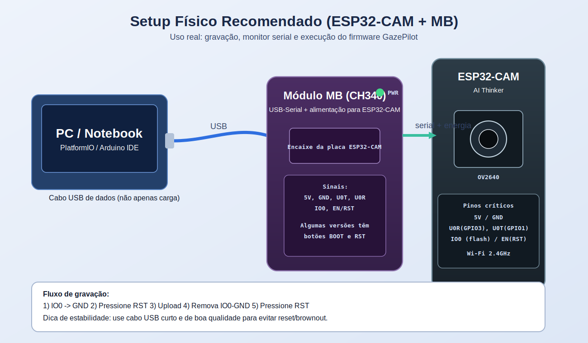
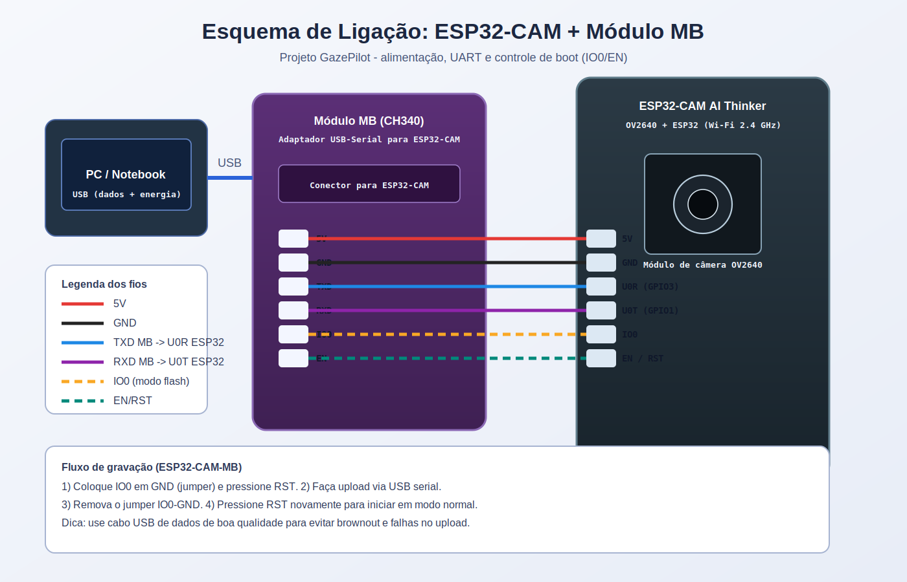
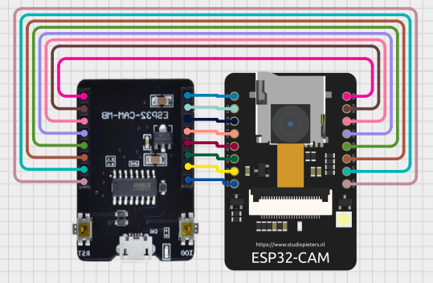

# Guia de Hardware (ESP32-CAM + MB)

Este documento descreve o hardware oficial do GazePilot:

- ESP32-CAM AI Thinker (OV2640)
- Módulo USB ESP32-CAM-MB (CH340 + regulação)
- Alimentação por USB 5V

As figuras desta pasta são autorais e em PT-BR:

- Ilustração do setup físico: `docs/assets/hardware/esp32-cam-setup.svg`
- Esquema elétrico de ligação (fiação/pinos): `docs/assets/hardware/esp32-cam-mb-schematic.svg`
- Referência visual adicional de pinagem MB+ESP32-CAM: `docs/assets/hardware/esp32-cam-circuit-reference.png`

## 1) Setup físico

### Componentes

- 1x ESP32-CAM (AI Thinker)
- 1x ESP32-CAM-MB (programador USB serial)
- 1x cabo USB de dados (não apenas carga)
- 1x jumper (para modo flash manual, se necessário)

### Visão ilustrativa



## 2) Esquema elétrico (MB + ESP32-CAM)



### Referência visual alternativa (imagem)



Observação:

- esta imagem é uma referência visual complementar;
- para validação técnica/pinagem oficial do projeto, mantenha o esquema autoral acima como fonte principal.

Resumo elétrico:

- USB do PC alimenta o MB com 5V.
- O MB fornece alimentação e serial para o ESP32-CAM.
- UART usada para gravação/log: U0T/U0R.
- GPIO0 define o modo de boot:
  - GPIO0 em GND no reset: modo flash.
  - GPIO0 solto (HIGH) no reset: execução normal.

## 3) Tabela de pinos

### 3.1 Pinos críticos para gravação e alimentação

| Sinal | ESP32-CAM | MB/Função | Uso |
|---|---|---|---|
| 5V | 5V | 5V USB | Alimentação |
| GND | GND | GND USB | Referência elétrica |
| U0R | GPIO3 (RX0) | TX do USB-Serial | Upload e logs |
| U0T | GPIO1 (TX0) | RX do USB-Serial | Upload e logs |
| GPIO0 | IO0 | Strap de boot | Flash / boot manual |
| EN/RST | EN | Reset | Reinicialização |

### 3.2 Pinagem da câmera OV2640 (AI Thinker)

Pinagem usada no firmware (`src/main_camera.cpp`):

| Função câmera | GPIO |
|---|---|
| PWDN | 32 |
| RESET | -1 (não conectado) |
| XCLK | 0 |
| SIOD (SDA) | 26 |
| SIOC (SCL) | 27 |
| Y9 | 35 |
| Y8 | 34 |
| Y7 | 39 |
| Y6 | 36 |
| Y5 | 21 |
| Y4 | 19 |
| Y3 | 18 |
| Y2 | 5 |
| VSYNC | 25 |
| HREF | 23 |
| PCLK | 22 |

Observação:

- GPIO0 é compartilhado com XCLK da câmera; o strap de boot só importa no reset/boot.

## 4) Alimentação e estabilidade

Recomendações práticas:

- Use cabo USB curto e de boa qualidade (dados + baixa queda de tensão).
- Evite portas USB fracas e hubs passivos para reduzir brownout.
- Se houver reset aleatório ao iniciar câmera/Wi-Fi:
  - troque o cabo USB;
  - troque a porta USB;
  - reduza carga (fps/qualidade) no backend.
- Em setups estendidos, prefira fonte 5V estável.

Sinais de problema de energia:

- boot loop no serial
- falha intermitente no `camera init`
- reinícios durante upload de frame

## 5) Gravação com módulo MB (passo a passo)

### Modo flash (manual)

1. Conecte ESP32-CAM no MB.
2. Coloque GPIO0 em GND (jumper IO0-GND), se necessário.
3. Pressione `RST`.
4. Faça upload do firmware.

### Modo execução normal

1. Remova o jumper IO0-GND.
2. Pressione `RST`.
3. Abra o monitor serial e confirme boot normal.

## 6) Comandos de gravação e monitor

PlatformIO (Windows, exemplo `COM5`):

```bash
python -m platformio run -d esp32-cam -e esp32-cam -t upload --upload-port COM5
python -m platformio device monitor -d esp32-cam -b 115200 --port COM5
```

## 7) Wokwi x hardware real

O alvo principal do projeto é hardware real ESP32-CAM + MB.

Sobre os arquivos de simulação:

- `esp32-cam/wokwi.toml` e `esp32-cam/diagram.json` ficam para simulação de API (`esp32-wokwi`).
- No Wokwi, a câmera é mock (não OV2640 real).
- A validação final de câmera/comandos deve ser feita no hardware físico.

## 8) Compatibilidade com seu módulo

O modelo citado (ESP32-CAM AI Thinker + módulo MB) é compatível com este guia, desde que:

- a placa selecionada seja `AI Thinker ESP32-CAM`;
- seja usado cabo USB de dados;
- o procedimento IO0/RST seja seguido quando necessário.
